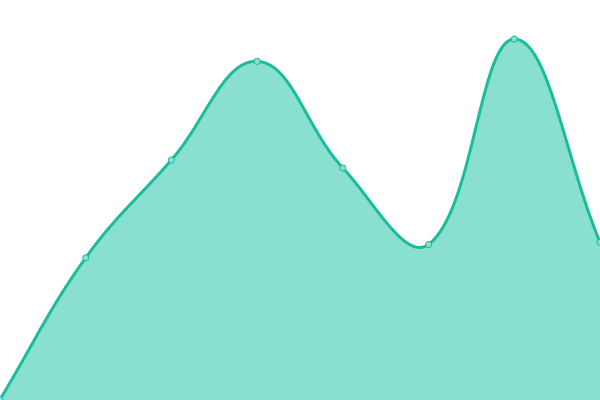

# 📈 Stickybomb 서비스 모니터

<!--start: status pages-->
<!-- This summary is generated by Upptime (https://github.com/upptime/upptime) -->
<!-- Do not edit this manually, your changes will be overwritten -->
<!-- prettier-ignore -->
| URL | Status | History | Response Time | Uptime |
| --- | ------ | ------- | ------------- | ------ |
|  [Production](https://www.stickybomb.kr) | 🟩 Up | [production.yml](https://github.com/trineedle/upptime-stickybomb/commits/master/history/production.yml) | 

 573ms
     
 | 

<a href="https://trineedle.github.io/upptime-stickybomb/history/production">100.00%</a>
    

|  [Staging](https://www.stickybomb-dev.kr) | 🟩 Up | [staging.yml](https://github.com/trineedle/upptime-stickybomb/commits/master/history/staging.yml) | 

 282ms
     
 | 

<a href="https://trineedle.github.io/upptime-stickybomb/history/staging">100.00%</a>
    

<!--end: status pages-->
